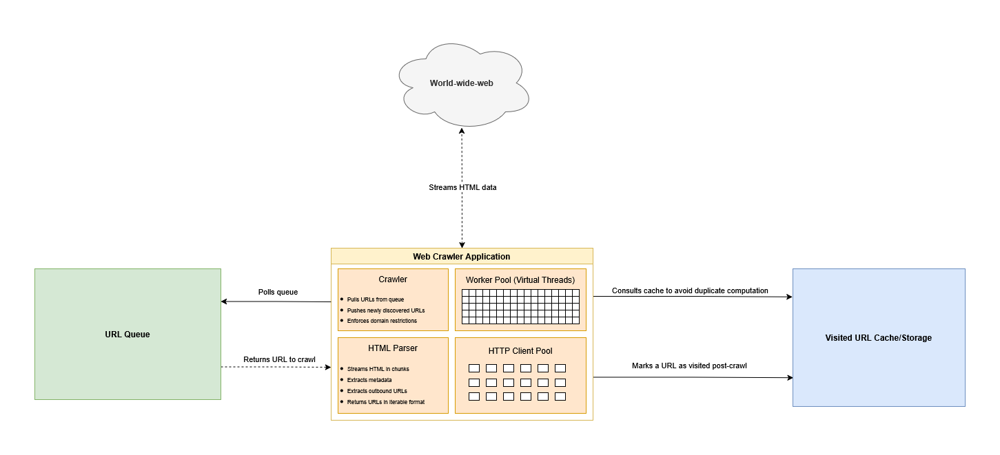
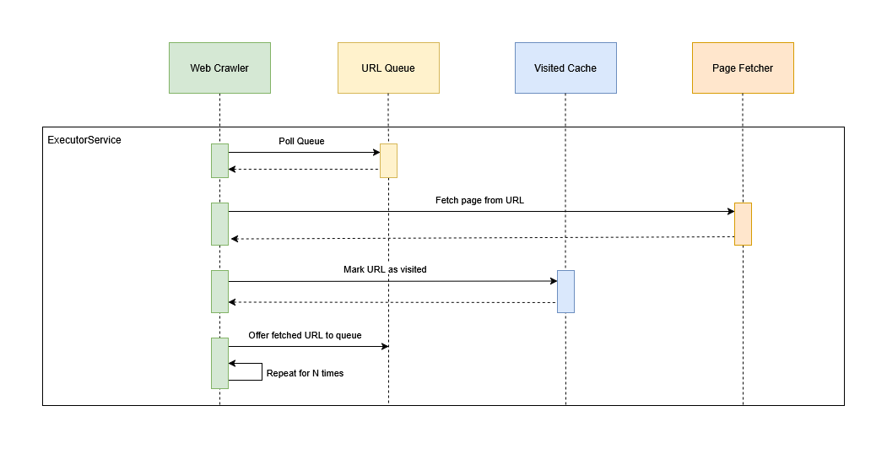

# WebCrawler Local Prototype

## Overview

This project implements a **simple web crawler** in Java designed for concurrency, robustness, and extensibility. Given a **starting URL**, the crawler visits each page on the **same subdomain**, extracts metadata and all internal links, and prints both the visited URL and the discovered links. External links (outside the starting subdomain) are ignored, keeping the crawl constrained to the target website.

Key considerations include:

- **Abstractions**: `UrlQueue` for managing URLs to visit, and `VisitedCache` for tracking visited pages.
- **Concurrency**: Uses Java 21 virtual threads to maximize throughput without blocking the system.
- **Memory efficiency**: Supports streaming HTML parsing to avoid loading large pages entirely into memory.
- **Extensibility**: Can swap the queue or visited cache with external systems like Kafka or Redis, while keeping the core crawler logic unchanged.
- **Testability**: Designed for unit and integration testing, with the ability to seed URLs and mock fetchers.

---

## Architecture

### Context Diagram


### Sequence Diagram

---

## Concurrency Model

The crawler is designed around the idea that **web crawling is inherently IO-bound and stateless**. Each URL fetch is a short-lived operation: the crawler makes an HTTP request, reads the HTML, extracts links, and then moves on. Because the task itself does very little CPU work and spends most of its time waiting for network responses, it is a perfect candidate for **virtual threads**.

### Virtual Threads

Virtual threads are a **lightweight abstraction over traditional Java platform threads**. Unlike regular threads, which map 1:1 to OS threads and carry significant memory and scheduling overhead, virtual threads are designed to **scale to very large numbers** without consuming excessive resources.

**How they work:**

- A virtual thread **does not occupy an OS thread for its entire lifetime**. Instead, it mounts onto a platform thread when actively executing code.
- When a virtual thread **encounters a blocking operation** (like network IO), it can automatically **unmount itself**, freeing the underlying platform thread for other work.
- Once the IO operation completes, the virtual thread **remounts onto a platform thread** to continue execution.

**Why this is ideal for web crawling:**

- Crawlers typically process a **very large number of very small, stateless tasks**. Each task involves fetching a page, parsing it, and discovering new URLs.
- Most of the latency in crawling comes from **blocking network IO**, not CPU computation.
- Using virtual threads allows us to **run thousands of concurrent fetches** without exhausting system threads or memory.
- The crawler can remain **responsive and efficient**, dynamically allocating CPU resources to active tasks while idle threads yield automatically.


*Figure 1: Virtual threads multiplexed onto platform threads. Source: [The Backend Guy](https://thebackendguy.com/posts/idea-behind-virtual-threads/)*

### Memory-Aware Concurrency

While virtual threads scale extremely well, the main consideration for a web crawler is **memory usage**. Each thread may hold references to in-flight HTML content, which can vary in size. To prevent uncontrolled memory growth:

- We use a **Semaphore-based concurrency limiter** to cap the number of virtual threads actively fetching pages at any given time.
- Pages are **read and parsed in streaming chunks**, so we never load a full page into memory.

Together, these measures **guarantee a predictable maximum memory footprint**. Given a known maximum buffer size per page and a defined semaphore limit, we can mathematically calculate the **upper bound of memory used for HTML content at any point**.


## HTTP Client and Pooling

The crawler uses **Java’s built-in `HttpClient`** for fetching pages. To allow multiple concurrent requests without creating a new client for every request, we maintain a **small pool of `HttpClient` instances**, each capable of handling multiple requests via **HTTP/2 multiplexing**. Requests are distributed in a round-robin fashion across this pool using an `AtomicInteger` counter.

This approach has several benefits:

- **Connection reuse within each client**: HTTP/2 allows multiple streams over a single TCP connection, reducing the overhead of repeatedly opening and closing sockets.
- **Controlled concurrency**: By limiting the number of clients and coordinating with the virtual-thread-based crawler, we avoid exhausting local ephemeral ports while still fetching many pages concurrently.

> **Note:** In a more mature production system, you might use an HTTP client library like **Apache HttpClient** or **Netty HTTP client**, which allows for **true TCP connection pooling across many requests**. This would give finer control over connections, timeouts, retries, and better performance under very high concurrency. For the scope of this project, we rely on a small rotation of built-in `HttpClient` instances with HTTP/2 multiplexing, which is sufficient for the expected load and keeps the implementation simple.

> **Scaling to multiple subdomains:**  
> In a production-grade crawler handling multiple domains or subdomains, we might maintain a **keyed pool of HTTP clients**, partitioned by host or host group (e.g., via a hash). This allows each domain to reuse TCP connections efficiently while still controlling concurrency per host. It also prevents one domain from monopolizing the connection pool and helps avoid ephemeral port exhaustion across multiple target hosts.

---

## Run Instructions

### 1. Build the application

This project uses **Gradle**. To compile the application:

```bash
./gradlew clean build
```

### 2. Run the crawler
This application uses the local spring profile by default. To start crawling from the https://crawlme.monzo.com/ URL, simply run:

```bash
./gradlew bootRun
```

---

## Stack
- Java 21
- Spring Boot (Manages application lifecycle, dependency injection, environment profiles, scheduling)
- Jsoup (Chunked HTML parsing)
- SLF4J
- JUnit 5

---

## Testing
- Unit test strategy
- Integration / end-to-end test examples

---

## Future Improvements
- **Distributed crawling architecture**
    - Containerise with Docker/Kubernetes for horizontal scaling.
    - Use a central queue (Kafka, RabbitMQ, AWS SQS) for URL distribution.
    - Use a central data store or cache depending on requirement (Redis, Cassandra, DynamoDB) for visited-URL deduplication.
    - Implement or hook up a bloom filter

- **More advanced HTTP/TCP connection handling**
    - Replace simple `HttpClient` rotation with a real connection-pooling library (Apache HttpClient, Netty, Jetty).
    - Pool and reuse TCP connections per host/subdomain to reduce handshake latency.
    - Add back-pressure, per-host rate limiting, and circuit breakers.

- **Smarter work distribution within a node**
    - Keyed or hashed object pools for connection clients per host group.
    - Pluggable URL-prioritisation strategies (BFS/DFS depth, scoring, freshness).

- **Improved HTML/Content processing**
    - Stream parsing of very large documents.
    - Support for JSON/GraphQL/API endpoints that produce discoverable links.

- **Operational visibility**
    - Metrics (Prometheus/OpenTelemetry), structured logging, traces of slow fetches.
    - Real-time dashboards showing concurrency, queue depth, error rates.

- **Robustness features**
    - Retry policies, exponential backoff, per-site politeness (robots.txt, crawl delays).
    - Graceful shutdown with state persistence.

---

## Notes for Interviewer


Key files relevant to the crawler’s core logic:

- **Crawler lifecycle & orchestration**  
  [`CrawlerExecutor`](crawler-app/src/main/java/org/crawler/app/CrawlerExecutor.java)

- **Main crawler loop & concurrency model**  
  [`WebCrawler`](crawler-engine/src/main/java/org/crawler/engine/WebCrawler.java)

- **Streaming HTML fetcher**  
  [`StreamingHtmlPageFetcher`](crawler-engine/src/main/java/org/crawler/engine/StreamingHtmlPageFetcher.java)

- **URL queue implementation (Local demo implementation)**  
  [`DemoLocalQueue`](crawler-engine/src/main/java/org/crawler/engine/queue/DemoLocalQueue.java)  

- **Visited URL cache / deduplication**  
  [`DemoLocalVisitedCache`](crawler-engine/src/main/java/org/crawler/engine/queue/DemoLocalVisitedCache.java)

- **Crawl URL model**  
  [`CrawlUrl`](crawler-model/src/main/java/org/crawler/model/CrawlUrl.java)

- **Crawl Result model**  
  [`CrawlResult`](crawler-model/src/main/java/org/crawler/model/CrawlResult.java)
